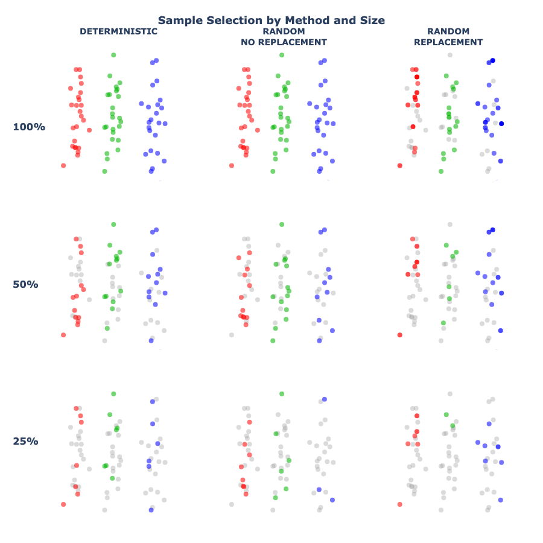
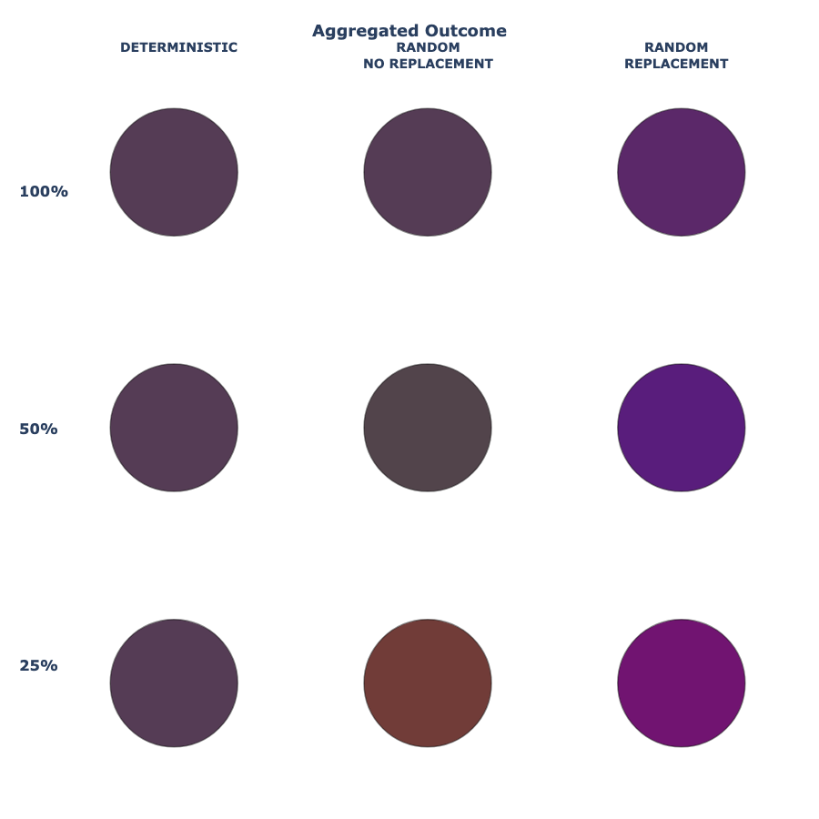

Sampling choices shape what we see in our data, even when the underlying population stays the same. Color variations result here by applying various sampling methods to red, green, and blue (RGB) to see the impact at a glance.

Each grid shows the same set of data points, colored red, green, and blue.
Rows compare different sampling approaches, while columns show how results change as fewer points are sampled.
Grey points indicate data that was not selected.

Looking for the data?

- [Notebook for data generation and visualization](/build-models/combining-colors-nb.ipynb)

- [Interavtive Binder setup for testing and exploration](https://mybinder.org/v2/gh/pixel-process-dev/pixel-process/binder-combining-colors?urlpath=lab/tree/combining-colors.ipynb)

## Why Red, Green, and Blue?

Red, green, and blue are not just three different colors — they are the building blocks of digital color. By representing data points as RGB values, sampling becomes visible as color mixing: selecting different subsets of the same data changes how those colors combine, and therefore what result we see.

This makes it possible to see sampling effects directly, without relying on numbers or equations.

## The Same Population, Sampled Different Ways

Across all of the visuals, the underlying data stays the same. What changes is how samples are drawn from that data.
Each row represents a different sampling approach, and each column shows what happens as fewer data points are selected.
Some methods select data in a fixed, predictable way, while others introduce randomness — including the possibility that the same data point is selected more than once.

These differences are subtle in the samples themselves, but they become clearer when the results are combined.

## Three Common Sampling Approaches

There are many ways to sample data. The visuals above focus on three common approaches that appear throughout data analysis and machine learning.

### Deterministic Selection

In deterministic sampling, data points are selected in a fixed, predictable way. Given the same data and the same rule, the result is always identical. This approach provides consistency, but it does not capture uncertainty or variability in the data.

### Random Selection (Without Replacement)

Random sampling without replacement selects data points at random, but each point can only be chosen once. This introduces variability while still preserving the overall structure of the data. Many standard statistical methods rely on this type of sampling.

### Random Selection (With Replacement)

Sampling with replacement allows the same data point to be selected multiple times. Some points may be repeated, while others may not appear at all. This small change has important consequences, especially when working with smaller samples.

## Why Sampling With Replacement Behaves Differently

When sampling with replacement, individual data points can have an outsized influence on the result. If the same point is selected multiple times, its contribution is amplified. This amplification is visible in the samples themselves and becomes even more apparent when the results are combined. As sample size decreases, this effect grows stronger.

Sampling with replacement is not “more random” — it is *differently* random.

## From Samples to Results

The top grid shows which data points were selected under each sampling method. The bottom grid shows the result of combining those selections. In this visualization, selected data points contribute their color to the final outcome. Points selected multiple times contribute more strongly.

Small differences in sampling can therefore lead to noticeable differences in results — even when the underlying data never changes.

## Why This Matters in Machine Learning

Sampling is not just a preprocessing step. It is a core part of many machine learning methods. Techniques such as bootstrapping, bagging, and random forests rely on repeated sampling to create diverse models. That diversity improves performance, but it also introduces variability.
Understanding how sampling shapes outcomes helps explain why models can disagree, why results can shift between runs, and why uncertainty matters alongside accuracy.

## Explore the Code

This visualization uses a simulated dataset created for demonstration purposes. Interested in learning more? *Try changing sample sizes, proportions, or sampling methods to see how the results respond.*

- [Full Static Notebook](/build-models/combining-colors-nb.ipynb)

- [Launch Binder session to start running the notebook in minutes!](https://mybinder.org/v2/gh/pixel-process-dev/pixel-process/binder-combining-colors?urlpath=lab/tree/combining-colors.ipynb) No installs or setup, learn more [about Binder](/create-code/binder-quickstart.qmd).

